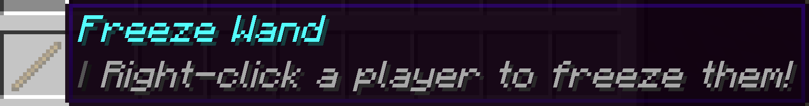

<h1 align="center">Freeze Wand</h1>

A simple freeze wand plugin, which allows admins and staff to freeze players by right-clicking them with a custom stick item.

<h2 align="center">Information</h2>

<a href="./CREDIT.md">Credit</a>

## License

&copy; 2024-2025 [Esoteric Enderman](https://enderman.dev)

[Freeze Wand](/) is licensed under the [AGPL 3.0](./LICENSE) only.

## Disclaimer

NOT AN OFFICIAL MINECRAFT PRODUCT. NOT APPROVED BY OR ASSOCIATED WITH MOJANG OR MICROSOFT.

## Topics

[java](https://github.com/topics/java), [minecraft](https://github.com/topics/minecraft), [spigot](https://github.com/topics/spigot), [paper](https://github.com/topics/paper), [spigotmc](https://github.com/topics/spigotmc), [spigot-plugin](https://github.com/topics/spigot-plugin), [minecraft-plugin](https://github.com/topics/minecraft-plugin), [paper-plugin](https://github.com/topics/paper-plugin), [java-plugin](https://github.com/topics/java-plugin), [minecraft-java](https://github.com/topics/minecraft-java), [papermc](https://github.com/topics/papermc), [minecraft-java-edition](https://github.com/topics/minecraft-java-edition), [papermc-plugin](https://github.com/topics/papermc-plugin), [papermc-plugins](https://github.com/topics/papermc-plugins), [minecraft-paper](https://github.com/topics/minecraft-paper), [minecraft-paper-plugin](https://github.com/topics/minecraft-paper-plugin), [minecraft-java-plugin](https://github.com/topics/minecraft-java-plugin), [java-21](https://github.com/topics/java-21), [java21](https://github.com/topics/java21), [learnspigot](https://github.com/topics/learnspigot)
